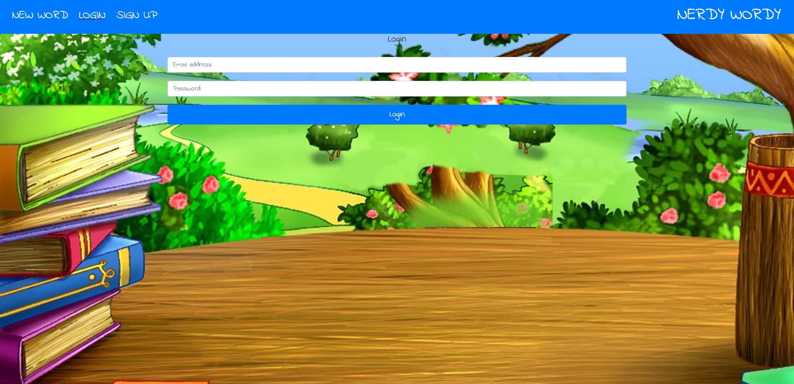
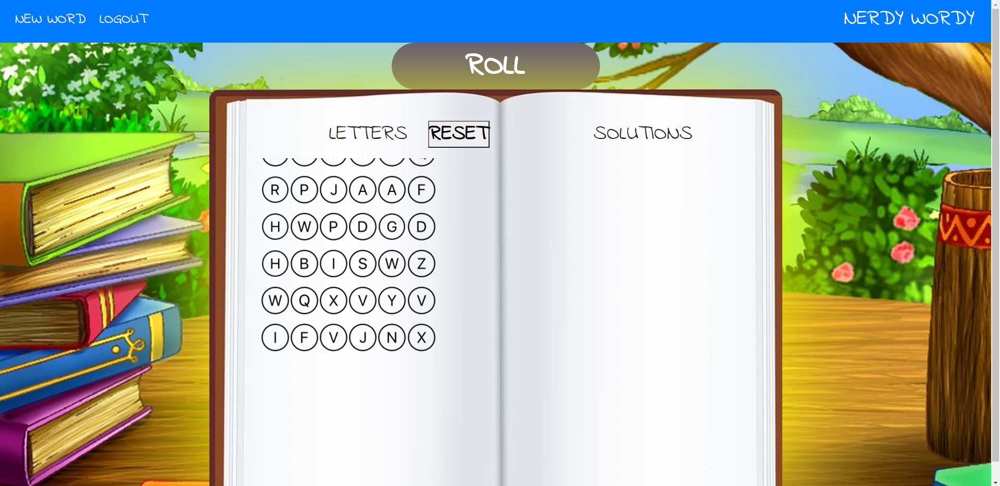
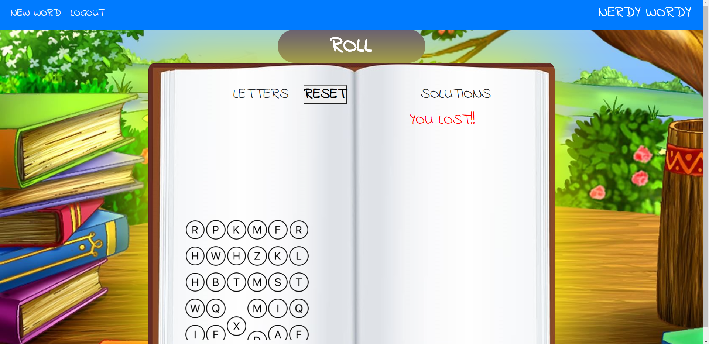

# NERDY_WORDY
### MERN_WITH_PASSPORT

# Table of Contents

- [Title](#title)
- [Description](#description)
- [Links](#links)
- [Usage](#usage)
- [GitHub Informationl](#github-information)
- [Credits](#credits)

# Title
## NERDY WORDY

# Description
### Nerdy Wordy is a childrens learning game!

This childrens game's  a great adddition to their visual and kinesthetic learning development. 
It's also a fun way to learn or solidify spelling, word memory, fine motor skills, vocabulary and strong computer literacy.
Nerdy Wordy can be a spectacular game for toddlers ages 3yrs to middle schoolers (and beyond).

The user/child adds the email and password.
Nerdy Wordy begins with a word dropping in to the top of the screen, with cascading letters moving downward on the left side of the game play area.
The user has to onClick and drag the correct letter one at a time to the drop area (right side of the screen-open area) to spell the provided word above. 

If they spell the word correctly they will receive a point. If the word is spelled incorrectly, no points are given. (In this first draft of the game we have no point system developed- only a message)

The user can also reset the rendering letters if the correct letters are not rendering the required letters for the word in the display. The app also has a new-word button to restart or change the word.

## Images
																				
|
|	

| 	|	|	
| 	|	

|
|

|
|

# Usages
* Axios
* Bootstrap
* bcrypt
* CSS
* Express
* HTML
* Mongodb
* Mongoose
* Passport
* Path
* Random-Words (API)
* React.js
* React-dnd
* NPM

# GitHub(s)
Andy Pedonti
 
https://github.com/andypedonti/andypedonti.github.io

Borjan Bartula
 
https://mrbusiness87.github.io/My-Portfolio/#about

Cameron Beam
 
https://ctbeam.github.io/My-Portfolio/#about

Kobie Watkins
 
https://kobac44.github.io/Portfolio2/

Deployed Application: https://nerdy-wordy.herokuapp.com/login

## Credits

- @Tim Nagorski[TA]
- @Carl Vega[TA]
- Zach Rickards- [Instructor]
- Andy Pedonti (Team Member)
- Borjan Bartola (Team Member)
- Cameron Beam (Team Member)
- Kobie Watkins (Team Member)
